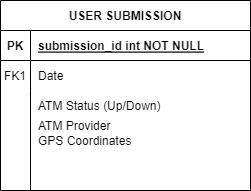

# ATM API

*Problem to Solve:*  Identifying the location and state of atm machines across Jamaica

*Technologies:*
Docker containers of the applications db, backend and frontend

Programming Languages:

- NodeJs
- React?
- Postgres

## Task 1: (The Schema)

## Task 2: (The Database)

|Task | Status |
|--|--|
|Create schema for ATM|✅|
|Initialize DB|✅|
|Containerize and develop api with  nodejs|
